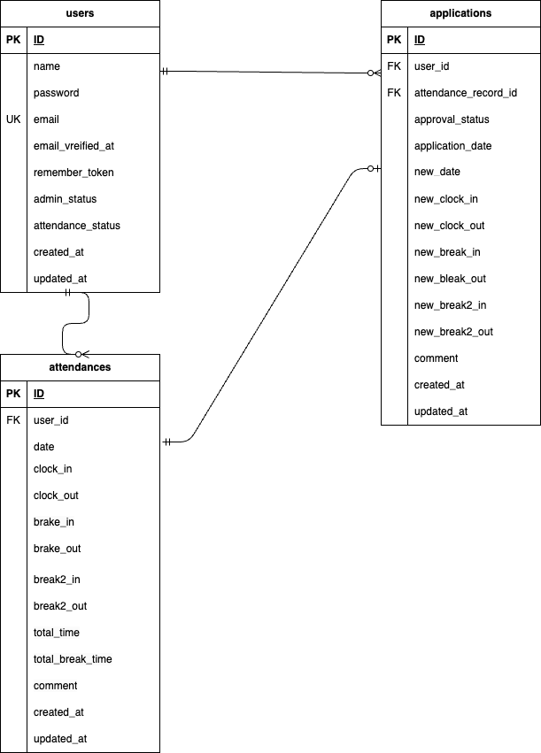

＃アプリケーション名

勤怠管理アプリ

＃環境構築

Docker ビルド

1.リポジトリをクローン

git clone git@github.com:Tomo-Taka6387/second-exam.git

2.DockerDesktop アプリを立ち上げる

docker-compose up -b --build

3.コンテナ起動確認

docker ps

#Laravel 環境構築

1.PHPコンテナに入る

docker-compose exec php bash

2.Composer依存関係インストール
composer install

3.「env.example」ファイルを 「.env」ファイルに命名を変更。

または、新しく.env ファイルを作成

4..env に以下の環境変数を追加

DB_CONNECTION=mysql

DB_HOST=mysql

DB_PORT=3306

DB_DATABASE=laravel_db

DB_USERNAME=laravel_user

DB_PASSWORD=laravel_pass

MAIL_MAILER=smtp

MAIL_HOST=mailhog

MAIL_PORT=1025

MAIL_USERNAME=null

MAIL_PASSWORD=null

MAIL_ENCRYPTION=null

MAIL_FROM_ADDRESS=example@example.com

MAIL_FROM_NAME="${APP_NAME}"

5.アプリケーションキーの作成

php artisan key:generate

6.マイグレーションの実行

php artisan make:migration

7.シーディングの実行(初期データ投入)

php artisan migrate

＃使用技術

\*PHP 8.1.33

\*Laravel 8.83.8

\*MySQL 8.0.42

＃URL

\*環境開発: http://localhost/

\*phpMyAdmin: http://localhost:8080/

#ログイン用テストアカウント

admin/管理者ユーザー
name:管理者ユーザー
email:admin@test.com
password:password

user/一般ユーザー
name:山田 太郎
email:taro.y@coachtech.co
password:password

＃ER 図

#メール認証
mailtrap というツールを使用しています。
以下のリンクから会員登録をしてください。
https://mailtrap.io/

メールボックスの Integrations から 「laravel 7.x and 8.x」を選択し、
.env ファイルの MAIL_MAILER から MAIL_ENCRYPTION までの項目をコピー＆ペーストしてください。
MAIL_FROM_ADDRESS は任意のメールアドレスを入力してください。

＃PHPunit テスト
１、テスト用データベース作成

docker-compose exec mysql bash
mysql -u root -p
//パスワードはrootと入力
create database test_database;

２、PHPコンテナに入り、テスト用マイグレーション実行
docker-compose exec php bash
php artisan migrate:fresh --env=testing

３、PHPUnit実行
./vendor/bin/phpunit

※アプリケーション使用上の注意点

1,下記２つのファイルは申請待ちor申請済みデータがない場合

”データがありません”の文言を表示する指定をしています。

申請一覧画面（一般ユーザー）user/application/index.blade.php

申請一覧画面（管理者）admin/request/index.blade.php

2,下記ファイルは当日の勤怠データがない場合

”データがありません”の文言を表示する指定をしています。

勤怠一覧画面（管理者）user/attendance/index.blade.php

3,下記ファイルの承認済みデータには

"承認済みのため修正できません"の文言を表示する指定をしています。

申請一覧画面（一般ユーザー）user/application/index.blade.php

4,もし一般ユーザーが管理者用ページにログインしようとした場合

または管理者が一般ユーザーページへへログインしようとした場合

"このアカウントではログインできません"の文言を表示する指定をしています。

ログイン画面（一般ユーザー）auth/login.blade.php

ログイン画面（管理者）admin/auth/login.blade.php

5,勤怠一覧画面から詳細画面へ遷移する際、該当の日に勤怠データがない場合は

"この日の勤怠は登録されていません。"の文言を表示する指定をしています。

勤怠詳細画面（一般ユーザー）user/attendance/show.blade.php

勤怠詳細画面（管理者）admin/attendance/show.blade.php
